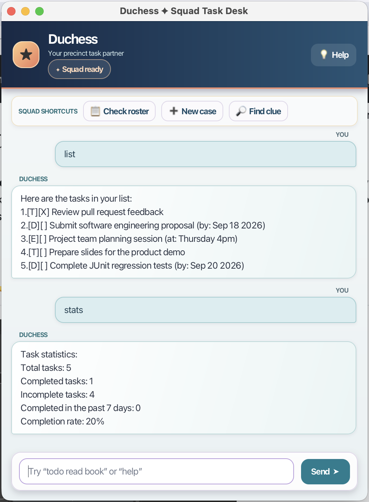

# Duchess User Guide



Duchess is a task manager with an original squad-room personality. She keeps
responses quick-witted, supportive, and lightly deadpan while helping users
manage todos, deadlines, events, searches, and completion statistics. The same
command behavior is available from the command-line interface and the JavaFX
graphical interface.

## Running Duchess

Use Java 25 and run one of the following Gradle tasks from the project root:

```text
./gradlew run       # JavaFX graphical interface
./gradlew runCli    # command-line interface
```

Tasks are saved in `data/duchess.txt` and loaded again the next time Duchess
starts. Records that cannot be parsed are skipped so that one malformed record
does not prevent the remaining tasks from loading. If records are damaged or
the file is unreadable, Duchess warns at startup and disables saving to protect
the file. Back it up, repair it or its permissions, and restart Duchess.

## Commands

### Add tasks

Add a general task with:

```text
todo <description>
```

Add a task with a date using:

```text
deadline <description> /by <yyyy-MM-dd>
```

For example, `deadline submit report /by 2026-09-30` creates a deadline task.

Add an event with:

```text
event <description> /from <yyyy-MM-dd> /to <yyyy-MM-dd>
```

For example, `event orientation /from 2026-09-15 /to 2026-09-17` creates
an event with a date range. The end date must be later than the start date.
Dates display as `Sep 15 2026`.

Existing events and the legacy `event <description> /at <time>` form remain
supported, preserving their original free-text times.

### View and search tasks

Use `list` to display every task in insertion order:

```text
list
```

Use `find <keyword>` to display tasks whose descriptions contain the keyword,
without changing the underlying task list:

```text
find report
```

Search results keep the task numbers shown by `list`. Use those numbers to
mark, unmark, or delete the matching task.

### Update tasks

Tasks are numbered starting from 1. Mark, unmark, or delete a task with:

```text
mark <task number>
unmark <task number>
delete <task number>
```

For example, `mark 2` marks the second task as completed.

### View statistics and help

Use `stats` to view a summary of the tasks currently managed by Duchess:

```text
Task statistics:
Total tasks: 2
Completed tasks: 1
Incomplete tasks: 1
Completed in the past 7 days: 1
Completion rate: 50%
```

The seven-day count includes completed tasks with a known completion time in
the previous seven days. Legacy completed records without a timestamp remain
readable and count toward the overall completed total.

Use `help` to display the supported commands and `bye` to exit Duchess.

## Input and recovery behavior

Duchess ignores harmless leading, trailing, and repeated whitespace in
commands. Required parameters must appear exactly once, dates must be real ISO
dates, and task numbers must be positive whole numbers that refer to an
existing task. A task with the same type and details as an existing task is
rejected as a duplicate.

A missing data file is treated as an empty task list. Malformed and duplicate
records are skipped while other valid records are loaded. If a change cannot
be saved because the data location is unavailable or access is denied, Duchess
keeps running, retains the in-memory change, and displays a save warning.
Changes made while saving is disabled are lost on exit. A successful save
after a temporary write failure saves the entire current list.

## JavaFX interface

The graphical interface uses JavaFX controls for the application window,
conversation area, command buttons, and composer. Its stable page structure is
declared in FXML. Each new message loads that reusable FXML layout; its Java
controller fills in the response text and applies the appropriate style.
Help uses the same response as the console interface.
